# Glamhour Relational Schema

## ERD

```mermaid
erDiagram
  users ||--o{ salon_owners : owns
  users ||--o{ salon_memberships : joins
  salons ||--o{ salon_owners : has
  salons ||--o{ salon_memberships : has
  salons ||--|| salon_settings : configures
  salons ||--|| onboarding_sessions : progresses
  salons ||--o{ salon_verification_documents : verifies

  salons ||--o{ services : offers
  service_categories ||--o{ services : classifies
  salons ||--o{ professionals : employs
  professionals ||--o{ professional_services : performs
  services ||--o{ professional_services : assigned_to
  salons ||--o{ clients : manages
  clients ||--|| client_health_profiles : has
  clients ||--o{ client_form_submissions : submits
  form_templates ||--o{ client_form_submissions : defines

  salons ||--o{ salon_working_hours : opens
  professionals ||--o{ professional_working_hours : works
  professionals ||--o{ availability_exceptions : adjusts
  salons ||--o{ appointments : schedules
  clients ||--o{ appointments : books
  professionals ||--o{ appointments : serves
  appointment_statuses ||--o{ appointments : describes
  appointment_statuses ||--o{ appointment_status_transitions : permits
  appointments ||--o{ appointment_services : contains
  services ||--o{ appointment_services : snapshots
  appointments ||--o{ appointment_status_history : tracks
  appointments ||--o{ appointment_events : audits

  appointment_services ||--o| treatment_records : produces
  treatment_records ||--o{ treatment_media : includes
  appointments ||--o{ consent_records : requires

  appointments ||--o{ payments : receives
  appointments ||--o| appointment_financials : snapshots
  appointments ||--o{ invoices : bills
  invoices ||--o{ invoice_items : contains
  payments ||--o{ payment_allocations : allocates
  invoices ||--o{ payment_allocations : receives
  payments ||--o| receipts : confirms
  appointments ||--o| reviews : receives

  salons ||--o{ notifications : sends
  salons ||--o{ salon_subscriptions : subscribes
  subscription_plans ||--o{ salon_subscriptions : defines
```



## Entity Groups

### Identity, Ownership, and Tenancy

`users` represents authenticated people. `salon_owners` explicitly models legal/business ownership, while `salon_memberships` controls application access roles. They are separate because ownership and day-to-day access are not always identical.

`professionals.user_id` and `clients.user_id` are optional. This supports the design today, where owners manage provider/client records, and the future client-facing application, where either may receive an account later.

### Onboarding and Configuration

`onboarding_sessions` stores resumable progress and temporary draft values. Once a step is committed, the authoritative data lives in relational tables such as `services`, `professionals`, and working hours.

`salon_settings` stores booking rules. Rare or future flags can live in `settings_json`, but frequently queried rules have typed columns.

### Catalog and Professionals

Global `service_categories` map directly to Nails, Lashes, Cosmetology, and Micropigmentation. Each salon creates its own `services`, with price/duration and public-booking controls. `professional_services` assigns the catalog to providers and permits per-provider overrides.

### Availability and Calendar

Availability is derived from:

1. Salon weekly working hours
2. Professional weekly working hours
3. Salon/professional availability exceptions
4. Existing active appointments
5. Service duration and salon booking settings

`availability_exceptions` supports closures, time off, temporary blocks, and available overrides. The appointment exclusion constraint prevents active provider overlaps at database level.

### Appointments and Status

`appointment_statuses` is a lookup table because statuses must be shared across both applications and may need labels/order without changing SQL types. `appointment_status_transitions` stores valid actor-specific transitions. `appointment_status_history` supports state history, while `appointment_events` records broader events such as reschedules, reassignment, and notification actions.

Appointments contain one or more `appointment_services`. Each line snapshots service identity, category, duration, and price for historical accuracy.

### Clinical and Treatment Records

The exported design contains large and materially different records for nails, lashes, cosmetology, and micropigmentation. Creating a column for every visible question would produce a brittle schema.

The hybrid model uses:

- `form_templates` for versioned form definitions
- `client_form_submissions` for intake/health/consent answers
- `treatment_records` for service-specific selections and procedure details
- `treatment_media` for photos and annotated diagrams
- `consent_records` for signatures and timestamps

This preserves structured, versioned records while keeping salon/client/appointment relationships relational.

### Payments and Sales

`payments` records actual money movement. `invoices` and `invoice_items` represent what was charged; `payment_allocations` supports split/partial payments; `receipts` confirm successful payments.

`appointment_financials` is an immutable completion-time business snapshot containing totals and the salon/professional earnings split. The `sales_history` view exposes the design's reporting screen without duplicating mutable sales rows.

### Reviews, Notifications, and Subscriptions

`reviews` is included for the future client-facing app even though reviews are not shown in the current exports.

`notifications` supports reminders and booking/status updates across email, SMS, push, WhatsApp, and in-app channels. `salon_subscriptions` records the plan state shown in Settings; provider webhook IDs are stored for the future billing integration.

## Important Transaction Boundaries

The future API must implement these operations transactionally:

- Create/reschedule appointment after checking availability
- Move appointment through valid status transitions
- Complete appointment and write treatment/financial snapshots
- Reassign all future appointments before removing a professional
- Create payment, allocation, invoice status update, and receipt
- Process subscription webhook events idempotently

## Access Control Model

Recommended API/database policy:

- Platform admin: verification and platform-level support only
- Owner/admin: all records for salons where membership is active
- Professional: assigned appointments, associated clients, and required treatment records
- Client: own future client-facing records only
- Public visitor: published catalog and calculated availability only; booking through a controlled endpoint

All queries should scope by `salon_id`, and the API must derive authorized salon IDs from the authenticated user's memberships.

## Future Backend/API Structure

Phase 3 should introduce a modular API with these domains:

```text
auth
salons
onboarding
catalog
professionals
clients
availability
appointments
treatments
payments
sales
notifications
subscriptions
public-booking
```

The backend should own transactions, authorization, availability calculation, payment/billing integrations, and signed media access. The frontend should never calculate authoritative money totals or write appointment completion directly across multiple tables.

## Frontend Implementation Plan

After Phases 2 and 3:

1. Establish Tailwind tokens and generic form/card/navigation primitives.
2. Build auth and onboarding against real API contracts.
3. Build salon configuration and professional management.
4. Build client search/profile and appointment calendar.
5. Build shared treatment-form renderer, then discipline-specific controls.
6. Build dashboard, sales history, share link, and settings/subscriptions.
7. Build the separate public booking application against the same catalog/availability/booking APIs.

No frontend implementation is part of Phase 1.
